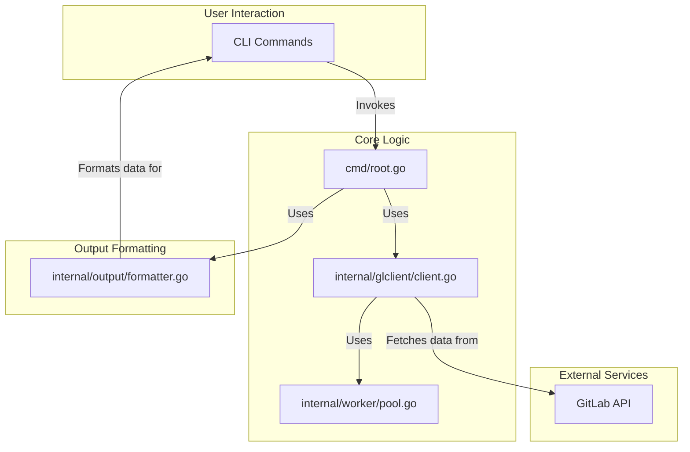

# Architecture Guide

This guide will help you understand how the application works and how to contribute effectively.

## What is glreporter?

**glreporter** is a CLI tool that asynchronously fetches and displays information about GitLab groups and their associated projects using the GitLab API. It supports recursive traversal of resource hierarchies and concurrent data fetching for performance.

**Key Features:**

- Fetches GitLab groups and projects asynchronously
- Supports recursive fetching of nested resources
- Supported resource types: groups, projects, tokens, variables
- Outputs data in table, JSON, and CSV formats

## Architecture Overview



### 1. Interface Segregation

Interfaces are defined by the **consumer**, not the provider. This allows for better decoupling and easier testing. For example, the `output` package defines a `Formatter` interface, which is then implemented by `TableFormatter`, `JSONFormatter`, and `CSVFormatter`.

```go
// Located in internal/output/formatter.go
type Formatter interface {
    FormatGroups(groups []*gitlab.Group) error
    FormatProjects(projects []*gitlab.Project) error
    // ... other methods
}

// NewFormatter returns a Formatter implementation based on the desired format.
func NewFormatter(format Format) (Formatter, error) {
    switch format {
    case FormatTable:
        return &TableFormatter{}, nil
    case FormatJSON:
        return &JSONFormatter{}, nil
    case FormatCSV:
        return &CSVFormatter{}, nil
    default:
        return nil, fmt.Errorf("%w: %s", ErrUnsupportedFormat, format)
    }
}
```

### 2. Dependency Injection

All components receive their dependencies through constructors. This makes the code more modular and easier to test. For instance, the `runReportCommand` function in `cmd/root.go` receives the `glclient.Client` as a dependency.

```go
// Located in cmd/root.go
func runReportCommand[T any](
    fetchFunc func(client *glclient.Client, groupID string) ([]T, error),
    formatFunc func(formatter output.Formatter, data []T) error,
    tokenErr error,
    spinnerSuffix string,
) error {
    // ...
    client, err := glclient.NewClient(tokenValue, debug)
    // ...
    data, err := fetchFunc(client, groupID)
    // ...
}
```

### 3. Context-First Design

Every operation that might take time accepts a context. This enables cancellation and timeouts, propagates request-scoped values, and is essential for graceful shutdowns.

### 4. Concurrency Model

- Uses a worker pool pattern with 10 concurrent workers
- Implements recursive fetching with goroutines and sync.Mutex for thread safety
- Handles pagination for API responses (100 items per page)

## Component Guide

### `cmd` Package

**What it does:** Defines the CLI commands using the `cobra` library. It handles user input, flags, and orchestrates the application's flow.

**Key files:**

- `cmd/root.go`: The root command, which initializes the application.
- `cmd/groups.go`: The command for fetching groups.
- `cmd/projects.go`: The command for fetching projects.
- `cmd/tokens.go`: The command for fetching tokens.
- `cmd/variables.go`: The command for fetching CI/CD variables.

**How it works:** Each command defines its own `RunE` function, which calls the `runReportCommand` helper to fetch and format data.

### `internal/glclient` Package

**What it does:** Acts as a client for the GitLab API. It encapsulates the logic for making API requests, handling pagination, and performing recursive fetching.

**Key files:**

- `internal/glclient/client.go`: The main client implementation.

**How it works:** The `Client` uses a worker pool to make concurrent API requests, improving performance. It also includes logic to recursively fetch subgroups and projects.

### `internal/worker` Package

**What it does:** Provides a simple worker pool for managing concurrent tasks.

**Key files:**

- `internal/worker/pool.go`: The worker pool implementation.

**How it works:** The `Pool` manages a fixed number of worker goroutines. Tasks are submitted to a channel and processed by the available workers.

### `internal/output` Package

**What it does:** Formats the fetched data into different output formats (table, JSON, CSV).

**Key files:**

- `internal/output/formatter.go`: The `Formatter` interface and its implementations.

**How it works:** The `NewFormatter` function returns the appropriate formatter based on the user's choice. Each formatter then implements the `Format*` methods to display the data.

## Data Flow Examples

### Fetching Groups

1. The user runs `glreporter groups --group-id <group-id>`.
2. The `groupsCmd` in `cmd/groups.go` is executed.
3. It calls `runReportCommand`, passing the `client.GetGroupsRecursively` function.
4. `GetGroupsRecursively` in `internal/glclient/client.go` fetches the root group and then recursively fetches all subgroups using the worker pool.
5. Once all groups are fetched, the data is passed to the `formatter.FormatGroups` function in `internal/output/formatter.go`.
6. The formatter displays the groups in the specified format (e.g., a table).

### Fetching Variables

1. The user runs `glreporter variables all --group-id <group-id>`.
2. The `variablesAllCmd` in `cmd/variables_all.go` is executed.
3. It creates a GitLab client and calls `fetchAllVariables`, which uses both `client.GetProjectVariablesRecursively` and `client.GetGroupVariablesRecursively`.
4. The client fetches variables from all projects and groups within the specified scope using concurrent workers.
5. The data is unified and passed to `formatAllVariables`, which calls `formatter.FormatUnifiedVariables`.
6. The formatter displays the variables in the specified format, optionally including values if `--include-values` is specified.

## Testing

### Running tests

```bash
go test ./...                      # All tests
go test ./pkg/repository/...       # Specific package
go test -run TestSpecificName      # Specific test
go test -cover ./...               # Run tests with coverage
go test -coverprofile=coverage.out # Generate coverage profile
go tool cover -html=coverage.out   # View coverage report in browser
```

### Writing tests

- Use table-driven tests for multiple cases
- Generate mocks with `go generate ./...`
- Database tests use in-memory SQLite

Example test structure:

```go
func TestMyFeature(t *testing.T) {
    // Setup
    db := setupTestDB(t)

    // Test cases
    tests := []struct {
        name    string
        input   string
        want    string
        wantErr bool
    }{
        // cases...
    }

    for _, tt := range tests {
        t.Run(tt.name, func(t *testing.T) {
            // Test implementation
        })
    }
}
```

## Code Organization

```text
glreporter/
├── cmd/                 # Contains CLI commands using spf13/cobra
│   ├── root.go          # Root command and common functionality
│   ├── groups.go        # Groups command
│   ├── projects.go      # Projects command
│   ├── tokens.go        # Token commands (gat, pat, ptt)
│   ├── tokens_*.go      # Individual token command implementations
│   ├── variables.go     # Variables command
│   └── variables_*.go   # Individual variable command implementations
├── internal/            # Internal packages
│   ├── glclient/        # GitLab API client with concurrent fetching capabilities
│   ├── output/          # Formatters for table, JSON, and CSV output
│   └── worker/          # Worker pool implementation for managing concurrent operations
└── main.go              # Entry point with version information injection
```

## Usage

For detailed usage instructions, refer to the [README.md](README.md#usage) file.
